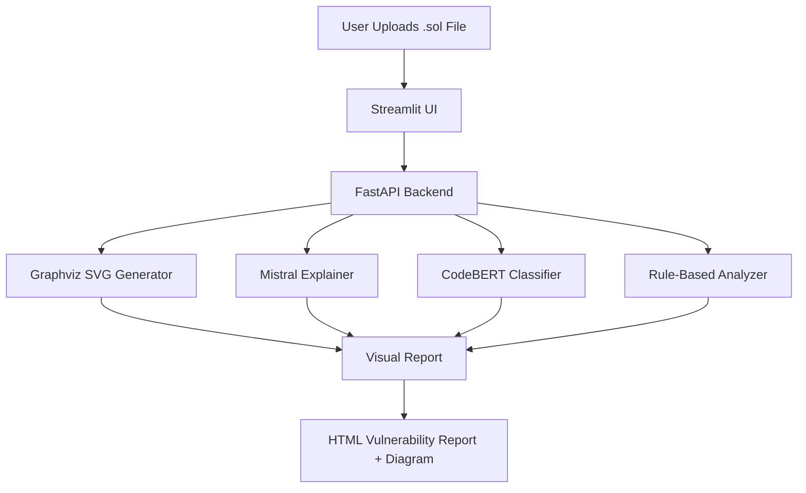

=======

# 🔐 ChainSage – AI-Powered Smart Contract Vulnerability Analyzer

**ChainSage** is an advanced AI-based security analyzer that detects, explains, and visualizes vulnerabilities in Ethereum-based Solidity smart contracts. Powered by a fusion of deep learning (CodeBERT, Mistral), anomaly detection (Isolation Forest), and rule-based logic, ChainSage offers a seamless DevSecOps solution through its powerful FastAPI backend and modern Streamlit UI.
>>>>>>> cc0743a (📝 Restored and updated professional README with full architecture, tech stack, features)


---


=======
## 🚀 Features

- 🤖 **AI-Powered Detection Engine**
  - Uses **CodeBERT** (fine-tuned on Solidity contracts) and **Mistral** for advanced contextual analysis
  - Identifies logical vulnerabilities like `Reentrancy`, `tx.origin misuse`, and more

- 🔍 **Hybrid Rule-Based Enhancements**
  - Custom detection for `.call()`, `unchecked-send`, and unprotected ownership transfer
  - Works alongside the ML models to increase reliability and precision

- 📊 **Dynamic Risk Diagrams with Graphviz**
  - Converts control flow into **visual threat maps**
  - Clearly highlights critical paths and exploitable entry points

- 🧠 **Streamlit-Powered Dashboard**
  - Upload Solidity `.sol` contracts for instant analysis
  - Displays AI-generated HTML reports and SVG graphs

- 🔐 **Secure Coding Recommendations**
  - Suggestions inspired by **OpenZeppelin**, **ConsenSys**, and **Slither** audits
  - Actionable prevention tips integrated into every finding

- ⚙️ **FastAPI & CLI Integration**
  - RESTful API for remote ML inference and contract analysis
  - Run directly via command-line or hook into CI/CD pipelines

- 🧪 **Included Vulnerable Contracts**
  - Sample `.sol` contracts with known issues for testing and demoing
  - Great for education, debugging, and benchmarking

---

## 🧠 AI & Detection Models Used

| Model               | Role                                                       |
|--------------------|------------------------------------------------------------|
| 🧠 **CodeBERT**     | Transformer model fine-tuned to classify Solidity snippets |
| 🔎 **Mistral-7B**   | Explains detected issues in natural language (via prompting) |
| 🌲 **Isolation Forest** | Detects outliers in contract structure/statistics      |
| ⚠️ **Rule Engine**  | Uses RegEx and patterns to detect risky Solidity behaviors |

---

## 🧱 Architecture & Workflow


>>>>>>> cc0743a (📝 Restored and updated professional README with full architecture, tech stack, features)

---

## 🛠️ Tech Stack


=======


**Components:**
- **Frontend**: Streamlit + Lottie + Custom HTML/CSS
- **Backend**: FastAPI + PyTorch + Transformers + Graphviz
- **ML Models**: CodeBERT, Mistral (via API), Isolation Forest

---
>>>>>>> cc0743a (📝 Restored and updated professional README with full architecture, tech stack, features)
### 📊 Dashboard View


### 📩 Response Example


### 🖼️ UI Screenshot


=======
---
## 📁 Directory Structure

```
ChainSage/
├── api/                            # FastAPI backend
│   └── routes/
│       └── vulnerability.py
├── ai_models/
│   └── vulnerability_detector.py   # Rule + ML-based inference logic
├── frontend/
│   └── streamlit_app/
│       └── app.py
├── models/
│   ├── codebert_classifier/        # Fine-tuned CodeBERT model
│   ├── isolation_forest.pkl
>>>>>>> cc0743a (📝 Restored and updated professional README with full architecture, tech stack, features)
│   └── ppo_wallet.zip
├── smart_contracts/
│   └── sample_contracts/
│       └── vulnerable_contract.sol

=======
├── assets/
│   └── Dashboard/
│   └── Response/
│   └── UI/
>>>>>>> cc0743a (📝 Restored and updated professional README with full architecture, tech stack, features)
├── mistral_vulnerability_checker.py
├── generate_dataset.py
├── evaluate_model.py
├── train_codebert_classifier.py
├── cli_infer.py
├── .env

=======
├── .gitignore
└── README.md
```

---

## ▶️ Getting Started

```bash
# Clone the repository
git clone https://github.com/Vaibhav06Jha28/ChainSage.git
cd ChainSage

# Setup Python virtual environment
python -m venv venv
venv\Scripts\activate  # Windows

# Install dependencies
pip install -r requirements.txt

# Start backend API
cd api
uvicorn main:app --reload

# Launch Streamlit frontend
>>>>>>> cc0743a (📝 Restored and updated professional README with full architecture, tech stack, features)
cd ../frontend/streamlit_app
streamlit run app.py
```


=======
> ⚠️ **Important**: Install Graphviz and ensure `dot` is available in system PATH.

---

## 📉 Sample Report Output

- **Type**: Reentrancy Attack
- **Detected By**: CodeBERT + Rule Engine
- **Severity**: 🔴 High
- **Explanation**: External call before state update
- **Fix**: Apply Checks-Effects-Interactions pattern or use `ReentrancyGuard`
>>>>>>> cc0743a (📝 Restored and updated professional README with full architecture, tech stack, features)

---

## 👨‍💻 Made By


=======
**Vaibhav Jha**  
🔗 [LinkedIn](https://www.linkedin.com/in/vaibhav-jha-27191b1ba/)  
🧑‍💻 [GitHub](https://github.com/Vaibhav06Jha28)

---

## 📜 License

MIT License © 2025 Vaibhav Jha

---
>>>>>>> cc0743a (📝 Restored and updated professional README with full architecture, tech stack, features)
