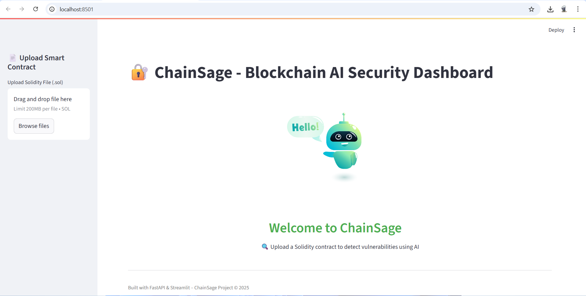
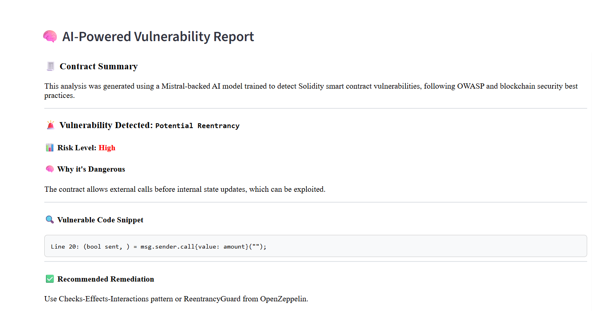
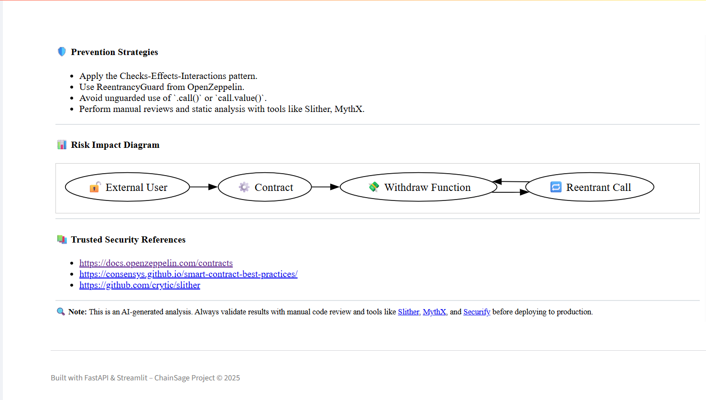
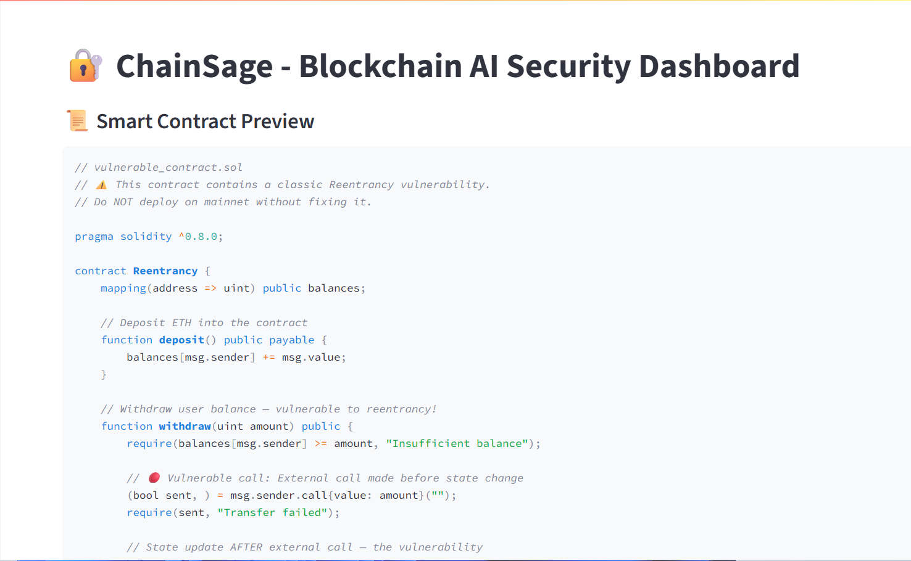

# 🔐 ChainSage – AI-Powered Smart Contract Vulnerability Analyzer

**ChainSage** is a cutting-edge AI-driven security toolkit that detects and explains vulnerabilities in Ethereum-based Solidity smart contracts. It leverages CodeBERT, Mistral, Isolation Forest, and custom rule-based detection, and presents results via a modern FastAPI backend and a Streamlit frontend dashboard – complete with live diagram generation using Graphviz.




---


🚀 Features
🤖 AI-Powered Detection Engine

Leverages CodeBERT + Mistral to understand Solidity code contextually

Detects deep, logic-based flaws that static tools often miss

🔍 Hybrid Rule-Based Enhancements

Identifies critical vulnerabilities like reentrancy, .call() misuse, unchecked external calls

Uses custom detection logic alongside ML

📊 Dynamic Risk Diagrams with Graphviz

Automatically generates visual threat maps from contract logic

Highlights risk flow using SVG-based diagrams

🧠 Interactive Streamlit Dashboard

Upload .sol smart contracts and instantly view detailed vulnerability reports

Clean UI with collapsible sections, icons, and rich HTML formatting

🔐 Secure Coding Recommendations

Built-in best practices from OpenZeppelin, ConsenSys, and Slither

Explains why a vulnerability is dangerous and how to fix it

⚙️ CLI + API Integration

Run audits via command line or integrate into CI/CD pipelines

FastAPI backend supports JSON-based analysis requests

🧪 Curated Vulnerable Contracts for Testing

Comes bundled with real-world vulnerable .sol contracts

Perfect for demos, benchmarking, or model evaluation


---


---
## 🖼 Sample UI

| Vulnerability Report | AI-Generated Risk Graph |
|----------------------|-------------------------|
|  |  |

---

## 🛠️ Tech Stack

- **Frontend**: Streamlit + HTML components + Lottie animations
- **Backend**: FastAPI + PyTorch + HuggingFace Transformers
- **Model**: CodeBERT fine-tuned on Solidity contracts
- **Visualization**: Graphviz (risk graph), Markdown (explanations)

---


### 📊 Dashboard View


### 📩 Response Example


### 🖼️ UI Screenshot



---
## 📂 Project Structure

```
ChainSage/
├── api/
│   └── routes/
│       └── vulnerability.py    ← FastAPI route for model-based vulnerability detection
├── ai_models/
│   └── vulnerability_detector.py
├── models/
│   └── codebert_classifier/    ← Fine-tuned CodeBERT model
│   └── isolation_forest.pkl
│   └── ppo_wallet.zip
├── smart_contracts/
│   └── sample_contracts/
│       └── vulnerable_contract.sol
├── frontend/
│   └── streamlit_app/
│       └── app.py              ← Streamlit frontend UI
├── test_contract.sol
├── mistral_vulnerability_checker.py
├── generate_dataset.py
├── evaluate_model.py
├── train_codebert_classifier.py
├── cli_infer.py
├── .env
├── requirements.txt
└── README.md                  ← You're here!
```


## ▶️ How to Run

```bash
# 1. Clone the repo
git clone https://github.com/Vaibhav06Jha28/ChainSage.git
cd ChainSage

# 2. Create virtual environment
python -m venv venv
venv\Scripts\activate

# 3. Install dependencies
pip install -r requirements.txt

# 4. Start backend (FastAPI)
cd api
uvicorn main:app --reload

# 5. Start frontend (Streamlit)
cd ../frontend/streamlit_app
streamlit run app.py
```

---

## ⚠️ Notes
- Ensure **Graphviz is installed** and `dot` is available in PATH.
- Backend runs at `http://localhost:8000/vulnerability/analyze`
- Make sure both Streamlit and FastAPI servers are running.

---

## 📉 Example Output

- Vulnerability Type: Reentrancy
- Risk Level: High
- Reason: External call before internal state update
- Recommendation: Use Checks-Effects-Interactions / ReentrancyGuard
- Dynamic Diagram: ✅ Auto-generated via Graphviz

---
## 📜 License

MIT License © 2025 Vaibhav Jha

---

## 👨‍💻 Made By

- **Vaibhav Jha**  
  🔗 [LinkedIn](https://www.linkedin.com/in/vaibhav-jha-27191b1ba/)  
  🧑‍💻 [GitHub](https://github.com/Vaibhav06Jha28)
